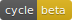

<h1 align=center>Hekateros  / </h1>

>God of the *hekateris*, a dance which involves quickly moving hands

Hekateros sits on an IRC channel and parses the http links that are posted on it, then displays them on a web interface.

You can find a live version on the [RezoSup](https://chat.rezosup.org/) on #Ekta-bots

## Key features

1. A filter system that you can turn on and off at runtime for both tags and URLs
2. Good resilience, by taking advantage of the Erlang/OTP runtime.
3. No external DBMS. It uses SQLite3 as an on-disk storage. Backup your data as easily as `scp`.
4. A responsive web interface.

## Administration

Hekateros provides an administration interface from IRC. You must be a registered administrator in the bot's system to operate it.

When you first invite Hekateros on an channel, it will send you a private message with a summary of its commands. Hekateros' underlying authentication
system is backed by the network's Services (NickServ). Other administrators will need to be registered to NickServ so they can be registered as
administrators.  

## Deployment

Un dossier `deploy` fourni un playbook Ansible avec le template et les fichiers de configuration utilisés. Le fichier `hosts` utilisé doit exporter la
variable `public_inteface` qui correspond à l'adresse sur laquelle Nginx va écouter.

## License

The code is licensed under the [MIT](LICENSE.txt) license.  
The Hekateros logo is licensed under the [CC BY-NC-ND 4.0](https://creativecommons.org/licenses/by-nc-nd/4.0/) license.
