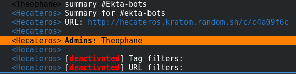

# Hekateros  / 

>God of the *hekateris*, a dance which involves quickly moving hands

Hekateros sits on an IRC channel and parses the http links that are posted on it, then displays them on a web interface.

You can find a live version on the RezoSup network, channel #Ekta

## How it works

Each time Hekateros sees a link that comes with tags, such as `http://example.org #example, w3c#` (1 link, two comma-separated tags enclosed in hashes), it
will parse it and record it in its database.

### Filtering

Filtering is done at the core of the IRC module. You can switch it on and off at runtime, and provide a list of available tags and disabled URLs.

## Deployment

Un dossier `deploy` fourni un playbook Ansible avec le template et les fichiers de configuration utilisés. Le fichier `hosts` utilisé doit exporter la
variable `public_inteface` qui correspond à l'adresse sur laquelle Nginx va écouter.
